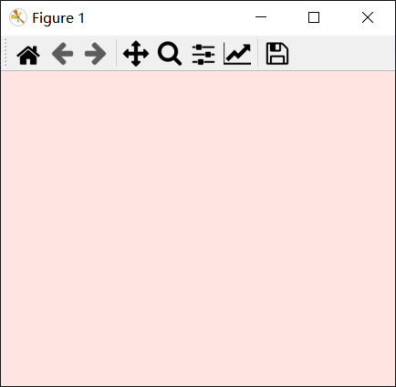
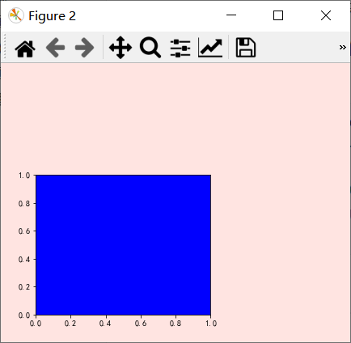
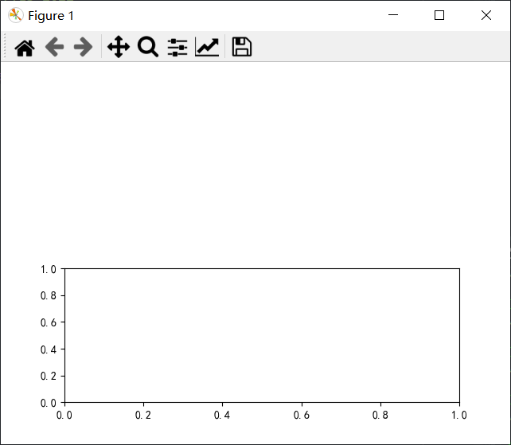
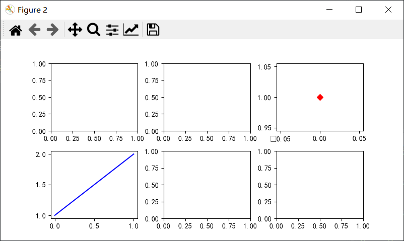
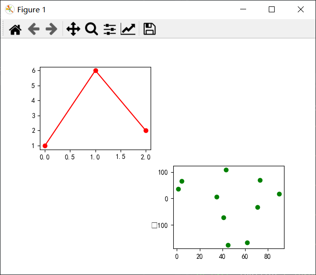
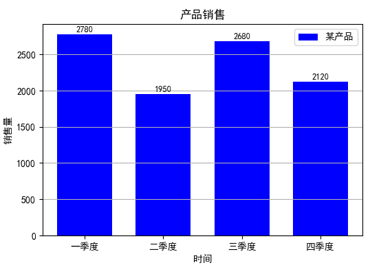

# Python可视化教程

### Matplotlib介绍

**Matplotlib** **官网地址** **http://matplotlib.org/**

✔ Python环境下实现Matlab制图功能的第三方库

✔ 可绘制二维和三维数据图表

✔ 提供迪卡尔坐标、极坐标、球坐标和三维坐标

✔ 制作的图形达到出版级的标准

✔ 可绘制多个子图

✔ 数据处理一般需要numpy库和pandas库的支持


### Matplotlib绘图基础

#### 1.子绘图库

- **pyplot**（一般用于项目文件中）

​		**import matplotlib.pyplot as plt**

- **pylab**（更适合于交互环境）

​	    **from pylab import \***

**区别**

pyplot：用别名plt引用绘图函数 ，如plt.plot

pylab： 直接调用 plot 函数

#### 2.图表的组成

Matplotlib的图表区包含三个层次

- **容器层** 由Canvas（画布）、Figure（绘图区）和Axes（坐标系）组成

  - **Canvas** 位于容器层的最底部（由系统自动创建） 

  - **Figure** 则建立在Canvas上面， 

  - **Axes** 则建立在Figure上面

一个Figure对象内可以包含多个Axes对象，每个Axes对象都是一个独立的坐标

系，绘图过程中所有图像都是基于坐标系绘制的。 

- **辅助显示层** 包括标题、坐标轴、坐标轴刻度、刻度标签、图例等。 

- **图像层** 绘制的柱状图、折线图、饼图、散点图等图像。

#### 3. 绘图区（画板/画布）

1. **自动创建绘图区**

   直接调用图表绘制函数，系统将自动创建一个绘图区

   默认大小为6.4*4.8英寸，即figsize=(6.4,4.8)

   分辨率为100，即dpi=100

   背景为白色，即facecolor=“white”

2. **手动创建绘图区**

​	   如果需要指定绘图区的大小、分辨率和背景颜色等参数

​       那么先调用figure()函数创建一个绘图区，然后再调用图表绘制函数

### 常用函数

---

#### **绘图区**

###### figure( )函数

用于生成一个全局绘图区。

```python
figure(num=None, figsize=None, dpi=None, facecolor=None, edgecolor=None, frameon=True)
```

- num:图像编号或名称，数字为编号 ，字符串为名称
- figsize:指定figure的宽和高，单位为英寸；
- dpi参数指定绘图对象的分辨率，即每英寸多少个像素，缺省值为80      1英寸等于2.5cm,A4纸是 21*30cm的纸张 
- facecolor:背景颜色
- edgecolor:边框颜色
- frameon:是否显示边框

注意：当前绘图区上没有建立坐标轴，默认不显示该全局绘图区。

例如：

```python
import matplotlib.pyplot as plt
plt.figure(figsize=(6,4.8),dpi=72,facecolor="mistyrose", edgecolor='b')
plt.show()
```



###### axes( )函数 ：

生成坐标系风格的绘图区并显示。 

用来在画图板上确认图形区的位置和大小的函数,缺省时该操作在figure()上操作。

```python
import matplotlib.pyplot as plt
plt.figure(figsize=(6,4.8),dpi=72,facecolor="mistyrose", edgecolor='b')
plt.axes((0.1,0.1,0.5,0.5),facecolor='b') #left,bottom,width,height
plt.show()
```



---

#### **子绘图区**

###### subplot( )函数：

在全局绘图区创建子绘图区并显示。

```python
subplot(nrows, ncols, index, **kwargs)
```

注意：如果nrows、ncols和index这三个数都小于10的话，可以把它们缩写为

一个整数，例如subplot(323)和subplot(3,2,3)是相同的。

> plt.subplot(212)



###### subplots()函数:

创建全局绘图区，然后添加多个子绘图区并显示所有子绘图区。

```python
import matplotlib.pyplot as plt
fig,ax = plt.subplots(nrows=2,ncols=3,figsize=(8,4),dpi=100) 
#fig 全局 ax 子图
plt.subplots_adjust(wspace=0.3,hspace=0.3) #中间的间距
ax[0][2].plot((1),'rD') 
ax[1][0].plot((1,2),'b') 
plt.show( )
```



###### add_subplot()函数

add_subplot(nrows, ncols, index[, \**kwargs])

用于给已有全局绘图区**添加子绘图区**

```python
import matplotlib.pyplot as plt
import numpy as np
fig1=plt.figure( ) #创建一个全局绘图区
fig1.add_subplot(221) #添加2行2列共4个子绘图区，只显示第1个
plt.plot((1,6,2),c='r',marker='o') #在第1个子绘图区绘制红色折线并输出标记
fig1.add_subplot(224) #指定显示第4个
x=np.random.randint(0,100,10) #随机生成10个坐标点（x,y）
y=np.random.normal(0,100,10)
plt.scatter(x,y,c='g') #在第4个绘图区输出随机生成的坐标点
plt.show( )
```



---

#### 常用图表绘制函数

| 函数                                                         | 描述                       |
| ------------------------------------------------------------ | -------------------------- |
| plt.plot(x,y,color,linewidth,linestyle,label)                | 根据x,y数组绘制直线或曲线  |
| plt.boxplot(data,notch,position)                             | 绘制一个箱型图             |
| plt.bar(x, height, width, bottom, *, align='center', **kwargs) | 绘制一个条形图（即柱状图） |
| plt.barh(y, width, height, left, *, align='center', **kwargs) | 绘制一个横向条形图         |
| plt.polar(theta,r)                                           | 绘制极坐标图               |
| plt.pie(data,explode)                                        | 绘制饼图                   |
| plt.scatter(x,y)                                             | 绘制散点图                 |
| plt.hist(x,bins,normed)                                      | 绘制直方图                 |
| plt.contour(X,Y,Z,N)                                         | 绘制等高线                 |

#### 坐标轴设置函数

| 函 数                                                       | 描 述                                                 |
| ----------------------------------------------------------- | ----------------------------------------------------- |
| plt.axis()                                                  | 显示当前坐标轴刻度的取值范围                          |
| plt.axes()                                                  | 显示子绘图区                                          |
| plt.xlim(xmin=1,xmax=5)                                     | 设置X轴刻度取值范围为[1,5]                            |
| plt.ylim(ymin=3,ymax=6)                                     | 设置Y轴刻度取值范围为[3,6]                            |
| plt.text(x,y,s,fontdic,withdash)如：plt.text(0.5,0.5,'Max') | 在指定位置添加注释文本在两个坐标轴的中间位置输出“Max” |
| plt.grid(True/Flase)                                        | 是否显示绘图网格                                      |


### 柱状图（条形图）


